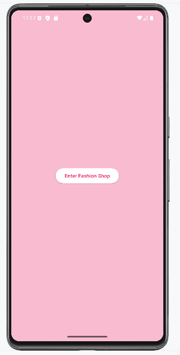
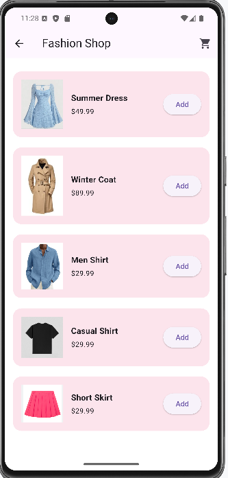
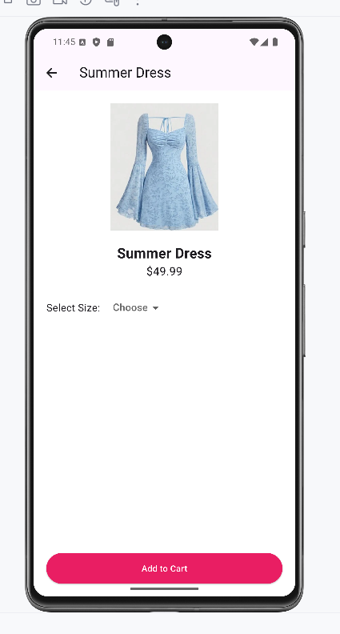
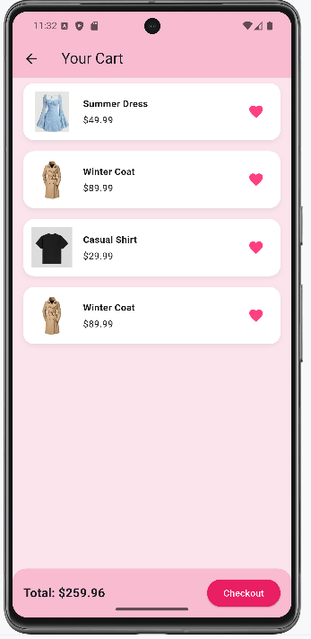

# 🛍️ Flutter Fashion Shop

This Flutter project is a simplified fashion shopping app developed as part of a mobile programming exercise. It includes a welcome page, a product listing grid, and a cart page with total pricing and item removal support. The layout is styled for a clothing store aesthetic.

---

## 📁 Project Structure

```
flutter assignment/
├── assets/
│   └── images/                  # Static assets for product visuals
│       ├── coat1.png
│       ├── dress1.png
│       ├── shirt1.png
│       ├── shirt2.png
│       └── skirt1.png
├── lib/
│   ├── models/
│   │   └── product.dart         # Product model (name, price, image)
│   ├── screens/
│   │   ├── welcome_screen.dart  # Initial welcome page
│   │   ├── home_screen.dart     # Grid layout for clothing products
│   │   └── cart_screen.dart     # Shopping cart with delete + total
│   └── main.dart                # App entry point and navigation setup
├── android/ ios/ linux/ macos/ web/ windows/
│                               # Platform folders created with `flutter create .`
```

---

## IDE PLATFORM

IntelliJ windows version

## ✅ Features Implemented

- 👋 Welcome screen with "Enter" button
- 🛒 Product list with grid layout and 'Add' button
- 🧮 Cart page:
  - Displays selected products with name, price, and image
  - Delete individual items
  - Total price calculation

---

## 🚀 How to Run

1. Make sure Flutter is installed: `flutter doctor`
2. Run the following commands:

```bash
flutter pub get
flutter run ./lib/main.dart       # Or use an emulator
```

You can also right-click `main.dart` and choose **Run 'main.dart'** once configured.

---

## Example Screenshots


- `welcome_screen.dart`
- `home_screen.dart`
- `cart_screen.dart`


``




```


Github Link:

(https://github.com/LouisaSally/Flutter_Mobile_Shop/)
